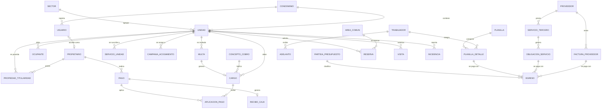

# Modelo de Datos — Condominio Muelle Azul

**Versión:** 1.0 · **Fecha:** 04/07/2026 · Motor: PostgreSQL 16 · Convención: tablas y columnas en `snake_case`, PK `id` (UUID v7), timestamps `created_at`/`updated_at`, borrado lógico con `activo`/`estado` (nunca DELETE físico en entidades con historia).

---

## 1. Diagrama entidad–relación (visión general)

---

## 2. Núcleo: personas y propiedades

### `condominio`
Datos generales (v1: una sola fila; deja el sistema listo para multi-condominio).
| Columna | Tipo | Notas |
|---|---|---|
| id | uuid PK | |
| nombre | varchar | "Asociación de Propietarios del Condominio Residencial de Playa Muelle Azul" |
| ruc | varchar | 20610523677 (aparece en los recibos de caja) |
| direccion, distrito | varchar | |
| moneda | char(3) | 'PEN' |
| logo_url | varchar | para PDFs |

### `sector` (catálogo de zonas del condominio)
| Columna | Tipo | Notas |
|---|---|---|
| codigo | varchar UNIQUE | MA_C, MA_A, MA_O, MA_N (datos reales) |
| nombre | varchar | MA Central (217 lotes), MA Ampliación (149), MA Oeste (31), MA Norte (27) |
| activo | boolean | |

Usado para reportes de recaudación y % de participación por zona (práctica actual de la administración).

### `usuario`
| Columna | Tipo | Notas |
|---|---|---|
| id | uuid PK | |
| email | citext UNIQUE | login |
| password_hash | varchar | Argon2id; null hasta activación |
| nombre_completo | varchar | |
| rol_id | FK → rol | |
| propietario_id | FK nullable → propietario | si rol = Propietario/Inquilino |
| estado | enum | INVITADO, ACTIVO, SUSPENDIDO |
| two_fa_secret | varchar nullable | |
| ultimo_acceso | timestamptz | |

### `rol` / `permiso` / `rol_permiso`
RBAC: roles sembrados (SUPER_ADMIN, ADMIN, CONTADOR, GARITA, PROPIETARIO, INQUILINO) y permisos granulares (`modulo.recurso.accion`).

### `propietario`
| Columna | Tipo | Notas |
|---|---|---|
| id | uuid PK | |
| tipo_documento | enum nullable | DNI, CE, RUC, PASAPORTE |
| numero_documento | varchar nullable | UNIQUE (tipo, numero); **null permitido**: los Excel actuales no registran documento — se completa al activar la cuenta del propietario |
| nombres, apellidos / razon_social | varchar | |
| email, email_secundario | varchar | los Excel registran hasta 2 correos por propietario |
| telefono, telefono_secundario | varchar | ídem teléfonos |
| canal_envio_preferido | enum | CORREO, WHATSAPP — columna "Envio" del maestro actual; define cómo se le hace llegar el estado de cuenta |
| direccion_habitual | varchar | residencia fuera del condominio |
| contacto_emergencia | jsonb | |
| activo | boolean | RN-P4: nunca se borra |

### `unidad`
Refleja la estructura real del padrón: 424 lotes identificados por sector + manzana + lote.
| Columna | Tipo | Notas |
|---|---|---|
| id | uuid PK | |
| codigo | varchar UNIQUE | `{sector}-{manzana}_{lote}` (ej. "MA_C-J_2"), inmutable (RN-U1) |
| sector_id | FK → sector | MA_C, MA_A, MA_O, MA_N |
| manzana | varchar | "A", "B1", "C2"... |
| lote | varchar | "1".."32" |
| tipo | enum | **CASA, TERRENO** (sin construir) — tipos reales del padrón; extensible |
| area_m2 | numeric(8,2) nullable | no existe en los Excel; se completará después |
| alicuota | numeric(7,4) nullable | hoy la cuota es monto fijo por lote; se conserva para futuro |
| base_calculo_cuota | enum nullable | null = usa la global; ALICUOTA, FIJO, M2 |
| monto_fijo_cuota | numeric(12,2) nullable | si base = FIJO |
| unidad_principal_id | FK nullable → unidad | agrupa lotes del mismo dueño para cobro consolidado (FU-02) |
| estado_ocupacion | enum | PROPIETARIO, ALQUILADA, DESOCUPADA, EN_VENTA |
| activo | boolean | |

### `tarifa_cuota` (historial de tarifas de mantenimiento)
| Columna | Tipo | Notas |
|---|---|---|
| vigente_desde | date | |
| tipo_unidad | enum nullable | permite tarifa distinta casa/terreno si aplica |
| sector_id | FK nullable | permite tarifa por zona si aplica |
| monto_mensual | numeric(12,2) | histórico real: S/ 100 (2021–2024), S/ 150 (2025+) — confirmar con administración |

Necesaria para emitir cargos históricos en la migración y para futuros cambios de cuota aprobados en asamblea.

### `propiedad_titularidad`  (histórico propietario ↔ unidad)
| Columna | Tipo | Notas |
|---|---|---|
| propietario_id, unidad_id | FK | |
| porcentaje | numeric(5,2) | copropiedad |
| es_responsable_pago | boolean | RN-P1: uno vigente por unidad (índice parcial único) |
| fecha_inicio, fecha_fin | date | fecha_fin null = vigente |

### `ocupante`  (inquilinos, residentes, personal doméstico) [F2]
unidad_id, tipo (INQUILINO_TEMPORAL, INQUILINO_ANUAL, FAMILIAR, PERSONAL_DOMESTICO), datos de identidad, `fecha_desde`, `fecha_hasta`, registrado_por. Clave para alquileres de verano (FA-04).

### `vehiculo` / `mascota` [F2]
`vehiculo`: unidad_id, placa UNIQUE, marca/modelo/color. `mascota`: unidad_id, tipo, nombre, observaciones.

---

## 3. Núcleo financiero: ingresos

### `concepto_cobro` (catálogo)
| Columna | Tipo | Notas |
|---|---|---|
| codigo | varchar UNIQUE | MANT, EXTRA, MORA, MULTA, VIGILANCIA, SALDO_INICIAL, OTRO. Conceptos reales detectados en los Excel: Constitución (2021), Navidad, Cuota Extraordinaria Oleaje (2025), Cuota Extraordinaria por Desastre → se crean como conceptos EXTRA con nombre propio |
| nombre | varchar | |
| es_recurrente | boolean | |
| genera_mora | boolean | la mora no genera mora |

### `emision` (cabecera de emisión masiva)
periodo (`date`, día 1 del mes), concepto_cobro_id, fecha_emision, fecha_vencimiento, estado (BORRADOR/PREVIEW, CONFIRMADA, ANULADA), total_emitido, creado_por. **UNIQUE (concepto, periodo)** → idempotencia.

### `cargo`
| Columna | Tipo | Notas |
|---|---|---|
| id | uuid PK | |
| unidad_id | FK | la deuda es de la unidad (RN-C4) |
| concepto_cobro_id | FK | |
| emision_id | FK nullable | null si es cargo individual |
| periodo | date nullable | |
| descripcion | varchar | |
| monto | numeric(12,2) | > 0 |
| fecha_emision, fecha_vencimiento | date | |
| estado | enum | PENDIENTE, PARCIAL, PAGADO, ANULADO |
| cargo_origen_id | FK nullable → cargo | mora → cargo que la generó; re-emisión → anulado |
| anulado_por, anulado_motivo, anulado_at | | RN-C1 |

Índices: `(unidad_id, estado, fecha_vencimiento)`; UNIQUE parcial `(unidad_id, concepto_cobro_id, periodo)` donde estado ≠ ANULADO.

### `pago`
| Columna | Tipo | Notas |
|---|---|---|
| id | uuid PK | |
| propietario_id | FK | quien paga |
| fecha_pago | date | |
| monto | numeric(12,2) | |
| moneda, tipo_cambio | char(3), numeric(8,4) | USD → PEN |
| medio | enum | TRANSFERENCIA, YAPE, PLIN, EFECTIVO, DEPOSITO, CHEQUE, PASARELA, MIGRACION. Uso real actual: BBVA (~85%), Yape, efectivo |
| banco, numero_operacion | varchar | |
| voucher_archivo_id | FK → archivo | comprobante |
| estado | enum | POR_VALIDAR, CONFIRMADO, RECHAZADO, ANULADO |
| declarado_por | enum | ADMIN, PROPIETARIO |
| validado_por, validado_at, rechazo_motivo | | |

### `aplicacion_pago`
pago_id FK, cargo_id FK, monto_aplicado numeric(12,2), aplicado_at, aplicado_por. Restricciones verificadas en la transacción de servicio: Σ por pago ≤ pago.monto; Σ por cargo ≤ cargo.monto.

### `saldo_favor`
propietario_id, monto_disponible, movimientos (`saldo_favor_movimiento`: origen pago_id / consumo cargo_id, monto, signo).

### `recibo_caja`
La administración emite hoy recibos de caja con **numeración correlativa global** (último observado: 798) y controla reimpresiones. El sistema continúa ese correlativo.
| Columna | Tipo | Notas |
|---|---|---|
| numero | int UNIQUE | correlativo global; secuencia PostgreSQL iniciada ≥ 799 tras la migración |
| serie | enum | CAJA (cuotas), VARIOS (otros conceptos) — series observadas en los Excel |
| pago_id | FK nullable → pago | recibo por cuotas |
| ingreso_vario_id | FK nullable → ingreso_vario | recibo por otros ingresos |
| detalle_periodos | varchar | texto impreso: "2026: Mayo Saldo", "Nov, dic 2024"... (derivado de las aplicaciones) |
| emitido_at, emitido_por | | |
| reimpresiones | int + `recibo_reimpresion` (quién/cuándo) | control de reimpresos |
| pdf_archivo_id | FK → archivo | |

### `ingreso_vario`
Ingresos que no son cargos de unidad: actividades (almuerzos, venta de platos), ventas varias, donaciones. Alimenta el flujo de caja como los pagos.
| Columna | Tipo | Notas |
|---|---|---|
| fecha, concepto, descripcion | | |
| unidad_id / propietario_id | FK nullable | si se conoce el aportante |
| monto, medio, numero_operacion | | |
| comprobante_archivo_id | FK | |
| estado | enum | REGISTRADO, ANULADO |

### `campania_regularizacion` [F2]
Soporta beneficios tipo **"Ponte al Día"** (campaña real de 2023: saldo reducido para regularizar deuda — S/ 300 casas con abonos / S/ 1,500 terrenos).
| Columna | Tipo | Notas |
|---|---|---|
| nombre, descripcion | | "Ponte al Día 2023" |
| fecha_inicio, fecha_fin | date | |
| estado | enum | VIGENTE, CERRADA |

`campania_acogimiento`: campania_id, unidad_id, deuda_original, monto_convenido, monto_abonado, estado (EN_CURSO, CUMPLIDA, INCUMPLIDA). Al cumplirse, los cargos cubiertos se marcan saldados vía ajuste auditado (condonación) — nunca se borran.

### `servicio_unidad` (servicios opcionales por lote) [F2]
Modela la **vigilancia de propiedad** (hoja "Seguridad" de los Excel): servicio mensual opcional al que se suscriben casas y terrenos, con cobro y estado de pago propios. Extensible a otros servicios opcionales.
| Columna | Tipo | Notas |
|---|---|---|
| unidad_id | FK | |
| tipo | enum | VIGILANCIA, OTRO |
| tarifa_mensual | numeric(12,2) | |
| fecha_inicio, fecha_fin | date | suscripción |
| estado | enum | ACTIVO, SUSPENDIDO, TERMINADO |

Cada mes, el job de emisión genera un cargo `VIGILANCIA` para las suscripciones activas (mismo motor de cargos).

---

## 4. Núcleo financiero: egresos

### `proveedor`
razon_social, ruc UNIQUE, rubro (FK → catálogo), contacto (nombre, email, teléfono), cuentas_bancarias jsonb, calificacion_promedio, activo.

### `servicio_tercero`
| Columna | Tipo | Notas |
|---|---|---|
| proveedor_id | FK | |
| nombre | varchar | "Vigilancia — turnos 24h" |
| categoria | FK → partida_presupuesto | clasificación de gasto |
| periodicidad | enum | MENSUAL, BIMESTRAL, TRIMESTRAL, ANUAL, VARIABLE |
| monto_referencial | numeric(12,2) | |
| dia_pago | int | |
| fecha_inicio, fecha_fin_contrato | date | alerta de renovación |
| contrato_archivo_id | FK | |
| estado | enum | VIGENTE, SUSPENDIDO, TERMINADO |

### `obligacion_servicio`
Generada por job según periodicidad: servicio_id, periodo, monto, vencimiento, estado (PENDIENTE, PAGADA, ANULADA).

### `factura_proveedor`
proveedor_id, tipo_comprobante (FACTURA, RHE, BOLETA, RECIBO), serie_numero, fecha_emision, monto, detalle, archivo_id, incidencia_id FK nullable (FI-03), estado (PENDIENTE, PAGADA_PARCIAL, PAGADA, ANULADA).

### `trabajador`
datos personales, puesto, tipo (ADMINISTRATIVO, MANTENIMIENTO, VIGILANCIA), tipo_contrato, fecha_ingreso, fecha_cese, sueldo_base, cuenta_bancaria, documentos (archivos), activo.

### `planilla` / `planilla_detalle`
`planilla`: periodo UNIQUE, estado (ABIERTA, CERRADA, PAGADA), totales.
`planilla_detalle`: planilla_id, trabajador_id, sueldo_base, bonificaciones jsonb, horas_extra, descuentos jsonb, adelantos_descontados, neto_pagar, estado_pago. RN-N2: cerrada ⇒ inmutable.

### `adelanto`
trabajador_id, fecha, monto, motivo, saldo_pendiente, estado. Se sugiere como descuento en la siguiente planilla (RN-N1).

### `egreso` (unifica todo pago de salida — alimenta caja y presupuesto)
| Columna | Tipo | Notas |
|---|---|---|
| id | uuid PK | |
| tipo_origen | enum | FACTURA_PROVEEDOR, OBLIGACION_SERVICIO, PLANILLA_DETALLE, OTRO |
| origen_id | uuid | referencia polimórfica al origen |
| partida_id | FK → partida_presupuesto | FB-02 |
| fecha_pago, monto, medio, numero_operacion | | |
| comprobante_archivo_id | FK | |
| estado | enum | REGISTRADO, ANULADO |

### `partida_presupuesto` / `presupuesto_anual` [F2]
`presupuesto_anual`: año, estado (BORRADOR, APROBADO), acta_archivo_id. `presupuesto_partida`: presupuesto_id, partida_id, monto_anual, distribucion_mensual jsonb.

---

## 5. Operación del condominio [F2]

### `area_comun` / `reserva`
`area_comun`: nombre, aforo, tarifa, requiere_aprobacion, reglas jsonb (anticipación, duración máx., máx. activas por unidad, bloqueo_moroso), horarios jsonb, activo.
`reserva`: area_id, unidad_id, solicitante_usuario_id, fecha, hora_inicio/fin, num_personas, estado (SOLICITADA, CONFIRMADA, RECHAZADA, CANCELADA, COMPLETADA), cargo_id FK nullable (tarifa). EXCLUDE constraint (PostgreSQL `tstzrange`) para impedir solapes por área.

### `visita` / `autorizacion_permanente`
`visita`: unidad_id, nombre, documento, placa nullable, tipo (VISITA, DELIVERY, PROVEEDOR, OBRERO, INQUILINO), preautorizada_por nullable, codigo_qr nullable, ingreso_at, salida_at, registrado_por (garita).
`autorizacion_permanente`: unidad_id, persona (nombre, doc), tipo, vigencia_desde/hasta.

### `incidencia`
codigo correlativo, unidad_id nullable (o área común), categoria FK, descripcion, fotos (archivos), prioridad, estado (REPORTADA, EN_EVALUACION, ASIGNADA, EN_EJECUCION, RESUELTA, CERRADA), asignado_tipo (TRABAJADOR | PROVEEDOR), asignado_id, costo_estimado, reportado_por, historial en `incidencia_evento` (append-only).

### `comunicado`
titulo, cuerpo (rich text), adjuntos, audiencia jsonb (TODOS | etapas | unidades[]), requiere_confirmacion, publicado_at, vigente_hasta; `comunicado_lectura`: comunicado_id, usuario_id, leido_at.

### `multa`
unidad_id, infraccion_id (catálogo `infraccion`: codigo, descripcion, monto_min/max), descripcion, evidencias, estado (NOTIFICADA, EN_DESCARGO, CONFIRMADA, ANULADA), cargo_id nullable (se crea al confirmar — FT-03).

### `documento` [F2]
carpeta, nombre, archivo_id, visibilidad (PUBLICO_PROPIETARIOS, SOLO_ADMIN), version, reemplaza_a FK nullable.

### `votacion` / `voto` [F3]
`votacion`: pregunta, opciones jsonb, tipo_padron, ponderacion (ALICUOTA | UNIDAD), abre_at, cierra_at, estado. `voto`: votacion_id, unidad_id UNIQUE por votación, opcion, emitido_por, emitido_at.

---

## 6. Transversales

### `archivo`
storage_key UNIQUE, nombre_original, mime, tamano_bytes, subido_por, entidad_tipo/entidad_id (referencia inversa), created_at. El acceso siempre valida permisos antes de firmar URL.

### `audit_log` (append-only, sin FK de borrado)
usuario_id, accion, entidad, entidad_id, datos_antes jsonb, datos_despues jsonb, ip, user_agent, created_at. Índice por (entidad, entidad_id) y por usuario.

### `configuracion`
clave UNIQUE, valor jsonb, descripcion. Ej.: `mora`, `base_calculo_cuota`, `recordatorios`, `cuentas_bancarias_condominio`, `reglas_reserva_default`, `feature_flags`.

### `notificacion`
usuario_id, tipo, titulo, cuerpo, canal (EMAIL, PANEL), estado (PENDIENTE, ENVIADA, FALLIDA), referencia (entidad/id), enviada_at.

---

## 7. Vistas / consultas derivadas

| Vista | Definición | Uso |
|---|---|---|
| `v_estado_cuenta_unidad` | cargos no anulados − aplicaciones confirmadas, por unidad | ficha de unidad, EECC |
| `v_estado_cuenta_propietario` | agrega la anterior por responsable de pago + saldo a favor | portal propietario, PDF |
| `v_morosidad` | cargos vencidos con bucket 1–30 / 31–60 / 61–90 / 90+ | reporte FC-07, bloqueo de reservas |
| `v_flujo_caja_mensual` | Σ pagos confirmados − Σ egresos por mes | dashboard, rendición |
| `v_ejecucion_presupuestal` | egresos por partida vs. presupuesto_partida | FB-02 |

## 8. Datos semilla (seed)

- Roles y permisos completos.
- **Sectores reales**: MA_C (MA Central), MA_A (MA Ampliación), MA_O (MA Oeste), MA_N (MA Norte).
- Conceptos de cobro: MANT, EXTRA, MORA, MULTA, VIGILANCIA, SALDO_INICIAL, OTRO + extraordinarias históricas (Constitución, Navidad, Oleaje, Desastre).
- **Tarifas históricas**: S/ 100/mes (Abr 2021–2024), S/ 150/mes (2025+) — confirmar con administración.
- Datos del condominio: Asociación de Propietarios del Condominio Residencial de Playa Muelle Azul, RUC 20610523677.
- Secuencia de recibos de caja iniciada en el correlativo siguiente al último migrado (≥ 799).
- Partidas de presupuesto según gastos reales: Mantenimiento integral (La Planicie), **Salvavidas (temporada)**, Vigilancia, Luminarias/eléctrico, Compras y materiales, Planilla, Administración, Fondo de reserva.
- Categorías de incidencia e infracciones base del reglamento.
- Áreas comunes de Muelle Azul — a confirmar con la administración.
- Usuario Super Admin inicial.

## 9. Migración de datos iniciales

La carpeta `Tablas/` contiene los Excel reales de la administración (padrón 2026, maestro de entes, historia de abonos desde abril 2021, ingresos/gastos y vigilancia). El análisis de esos archivos, el mapeo campo a campo, los problemas de calidad detectados y el proceso de importación en 8 pasos están en el documento dedicado **[05 — Migración de Datos](05-MIGRACION-DATOS.md)**.

Resumen: se migran ~424 unidades en 4 sectores, propietarios con contactos (sin documento de identidad — se completa en la activación), cargos históricos mes a mes desde abril 2021 con la tarifa vigente de cada año, pagos históricos (consolidados 2021–2025, detallados con recibo/medio en 2026), egresos 2026, y suscripciones de vigilancia; con reporte final de cuadre contra la columna "Saldo por Pagar" del Excel.
